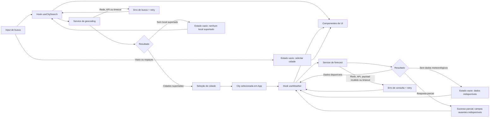

# Plano Técnico: Aplicação de Previsão do Tempo

Fonte da verdade: [specs/weather-app-spec.md](../specs/weather-app-spec.md). Este documento define arquitetura e contratos para o MVP; não contém implementação. Requisitos são referenciados pelos IDs RF, AC e RNF da especificação.

## Architecture

Aplicação web React de página única, sem backend próprio. Separar o fluxo em quatro camadas pequenas: `components` renderiza e recebe interações; `hooks` coordena estado e operações; `services` acessa Open-Meteo; `lib` contém transformações e regras puras. `App.tsx` conecta a tela ao hook principal.

```text
App.tsx
  -> components/  (props, eventos e apresentação)
  -> hooks/       (estado, loading/erro, seleção, retry)
  -> services/    (fetch, timeout e resposta HTTP)
  -> lib/         (normalização, catálogo, unidades e datas)
  -> Open-Meteo
```

- Componentes não chamam APIs nem implementam regras de negócio; recebem dados/estados por props e reportam ações por callbacks.
- Hooks são a fronteira de orquestração: guardam o estado volátil da tela, acionam serviços, descartam respostas obsoletas e expõem ações/dados prontos para os componentes. Não duplicam lógica de transformação.
- Services encapsulam URLs/parâmetros, `fetch`, timeout/cancelamento e erros de transporte. Delegam mapeamento de payload e regras puras à `lib`; não dependem de React.
- `lib` não importa React, hooks ou services. Contém funções puras para normalizar respostas, filtrar/ordenar cidades do catálogo, converter unidades, interpretar datas no fuso do local e validar atualidade.
- Os tipos de domínio compartilhados (`City`, `CurrentWeather`, `ForecastDay`, `WeatherData` e `Unit`) podem residir em `lib/types.ts`; tipos específicos do payload externo ficam junto ao parser que os consome.

Essa direção de dependências mantém cada camada substituível: componentes podem ser testados com props/eventos, hooks com services simulados, services com `fetch` mockado e funções de `lib` com entradas/saídas determinísticas. Testes E2E cobrem o fluxo integrado, sem exigir chamadas reais à Open-Meteo.

O fluxo cobre RF1–RF5; sem autenticação, armazenamento persistente, cache ou serviço de backend, em linha com o escopo aprovado.

## Tech Stack

- TypeScript strict, React 19 e Vite: stack já configurada no repositório para a aplicação web responsiva (RNF2).
- Tailwind CSS: solução de estilo já prevista pelo projeto; implementar responsividade, foco visível e contraste WCAG 2.2 AA (RNF3).
- Open-Meteo Geocoding e Forecast, acessados do navegador sem chave: fonte aprovada no RF1–RF3 e RNF5. Não adicionar proxy/backend no MVP.
- Vitest e Testing Library para testes unitários/de interface; Playwright para fluxos nos navegadores da matriz, conforme setup existente.
- Biome para lint e formatação, conforme scripts do projeto.

## Project Structure

Estrutura proposta dentro de `src/`; os nomes de arquivo são pontos de partida, mantendo um componente por arquivo:

```text
src/
  App.tsx
  components/
    CitySearch.tsx       # Entrada e sugestões acessíveis
    CurrentWeather.tsx   # Condições atuais
    ForecastList.tsx     # Previsão diária
    UnitToggle.tsx       # Alternância Celsius/Fahrenheit
    QueryState.tsx       # Loading, vazio, erro e retry
  hooks/
    useCitySearch.ts     # Busca, resultados e seleção
    useWeather.ts        # Consulta meteorológica e retry
  services/
    geocodingService.ts  # Requisição e erros de geocoding
    weatherService.ts    # Requisição e erros de forecast
  lib/
    types.ts             # Contratos de domínio compartilhados
    weatherMapper.ts     # Payload Open-Meteo -> tipos de domínio
    cityCatalog.ts       # Filtro e prioridade de cidades
    temperature.ts       # Conversão e arredondamento
    weatherDate.ts       # Datas locais e atualidade
tests/
  unit/                  # Serviços e funções puras
  components/            # Renderização e interação via Testing Library
  e2e/                   # Fluxos integrados via Playwright
```

Manter somente módulos necessários ao fluxo do MVP; evitar abstrações genéricas ou um store global. Os arquivos de teste permanecem em `tests/`, conforme os scripts e a organização prevista pelo projeto.

## Data Model

Tipos internos representam dados normalizados, não o formato bruto do provedor. Campos meteorológicos podem faltar (RF2, RF3, AC5.7); ausência não deve ser substituída por zero ou estimativa.

```ts
type Unit = "celsius" | "fahrenheit";

interface City {
  id?: number; // Identificador do local, quando retornado pelo geocoding
  name: string; // Nome da cidade retornado pela Open-Meteo
  latitude: number; // Latitude usada na consulta meteorológica
  longitude: number; // Longitude usada na consulta meteorológica
  country?: string; // País do local, quando disponível
  countryCode?: string; // Código do país retornado como country_code
  region?: string; // Região administrativa, normalmente admin1
  timezone?: string; // Fuso horário IANA do local, quando disponível
}

interface CurrentWeather {
  observedAt?: string; // Horário local retornado em current.time
  temperatureC?: number; // Temperatura de current.temperature_2m em Celsius
  conditionCode?: number; // Código WMO de current.weather_code
  humidityPercent?: number; // Umidade relativa de current.relative_humidity_2m
  windKmh?: number; // Vento de current.wind_speed_10m em km/h
  pressureHpa?: number; // Pressão de current.surface_pressure em hPa
  precipitationMm?: number; // Precipitação de current.precipitation em mm
}

interface ForecastDay {
  date: string; // Data civil local de daily.time no formato YYYY-MM-DD
  minimumC?: number; // Mínima diária de temperature_2m_min em Celsius
  maximumC?: number; // Máxima diária de temperature_2m_max em Celsius
  conditionCode?: number; // Código WMO diário de weather_code
  precipitationMm?: number; // Total diário de precipitation_sum em mm
  windKmh?: number; // Máxima diária de wind_speed_10m_max em km/h
}

interface WeatherData {
  city: City; // Local selecionado para a consulta
  timezone: string; // Fuso IANA retornado pela API Forecast
  current?: CurrentWeather; // Condições atuais; ausente quando não há dados
  forecast: ForecastDay[]; // Dias disponíveis, até cinco datas locais
  fetchedAt: string; // Instante UTC da consulta, para avaliar atualidade
}
```

Resultados de busca e operações assíncronas devem distinguir sucesso vazio de falha. Usar uma união discriminada simples para os estados de tela, por exemplo `idle | loading | success | empty | unavailable | error | timeout`, com mensagem e dados associados conforme o estado. `unavailable` representa resposta sem dados meteorológicos; campos parciais permanecem opcionais dentro de `success`.

Guardar temperaturas normalizadas em Celsius. Fahrenheit é apenas apresentação derivada: $F = (C \times 9/5) + 32$; converter de volta só quando a entrada estiver em Fahrenheit. Arredondar ao grau inteiro mais próximo na apresentação (RF4), sem alterar valores não térmicos.

## Data Flow



1. A pessoa envia o nome da cidade. Entrada vazia ou composta por espaços não inicia requisição (AC5.4); acentos e pontuação são preservados e enviados com encoding de URL.
2. O serviço de geocoding consulta Open-Meteo. Normaliza resultados para `City`, mantém cidades brasileiras retornadas pela fonte e capitais internacionais da lista fechada aprovada, exclui outros locais internacionais e ordena Brasil primeiro (RF1, AC1.1–AC1.7).
3. Resposta vazia após filtro apresenta “nenhum local suportado encontrado”; não dispara consulta meteorológica. Falha de rede/serviço e timeout são estados diferentes de vazio.
4. A seleção de uma sugestão substitui a cidade e os dados anteriores. O serviço de previsão consulta coordenadas selecionadas, normaliza os campos e fixa `fetchedAt` no instante da consulta.
5. A UI apresenta clima atual e até cinco dias consecutivos conforme datas locais do lugar, com valores ausentes explicitamente indisponíveis. Erros não mantêm os dados anteriores com aparência de atuais.
6. A unidade escolhida afeta somente a apresentação de todas as temperaturas atuais e diárias; o padrão é Celsius e alternar unidades não repete a consulta.
7. Nova tentativa refaz manualmente a operação que falhou usando o termo ou cidade já selecionados; não há repetição automática.

## External APIs

**Geocoding**

- Endpoint: `GET https://geocoding-api.open-meteo.com/v1/search`
- Parâmetros relevantes: `name` (termo de busca), `count` (limite de sugestões), `language=pt` e `format=json`.
- Exemplo de URL: `https://geocoding-api.open-meteo.com/v1/search?name=Curitiba&count=10&language=pt&format=json`
- Exemplo resumido de resposta:

```json
{
  "results": [
    {
      "id": 3452925,
      "name": "Curitiba",
      "latitude": -25.4296,
      "longitude": -49.2719,
      "country": "Brazil",
      "country_code": "BR",
      "admin1": "Parana",
      "timezone": "America/Sao_Paulo"
    }
  ]
}
```

- Mapeamento para `City`: `id`, `name`, `latitude`, `longitude`, `country`, `country_code` → `countryCode`, `admin1` → `region` e `timezone`. Propriedades geográficas que não vierem na resposta permanecem opcionais; requerer coordenadas para permitir seleção/consulta.
- Após mapear, manter cidades brasileiras retornadas pela fonte e capitais internacionais explicitamente aprovadas na spec; excluir outros locais internacionais e ordenar resultados brasileiros primeiro. A lista internacional deve ser comparada de forma determinística por nome e país.

**Forecast**

- Endpoint: `GET https://api.open-meteo.com/v1/forecast`
- Parâmetros de localização/tempo/unidades: `latitude`, `longitude`, `timezone=auto`, `forecast_days=5`, `temperature_unit=celsius`, `wind_speed_unit=kmh` e `precipitation_unit=mm`.
- Parâmetro `current`: `temperature_2m,relative_humidity_2m,weather_code,wind_speed_10m,surface_pressure,precipitation`.
- Parâmetro `daily`: `temperature_2m_min,temperature_2m_max,weather_code,precipitation_sum,wind_speed_10m_max`.
- Exemplo de URL (coordenadas ilustrativas): `https://api.open-meteo.com/v1/forecast?latitude=-25.43&longitude=-49.27&current=temperature_2m,relative_humidity_2m,weather_code,wind_speed_10m,surface_pressure,precipitation&daily=temperature_2m_min,temperature_2m_max,weather_code,precipitation_sum,wind_speed_10m_max&timezone=auto&forecast_days=5&temperature_unit=celsius&wind_speed_unit=kmh&precipitation_unit=mm`.
- Exemplo resumido de resposta (unidades omitidas):

```json
{
  "timezone": "America/Sao_Paulo",
  "current": {
    "time": "2026-10-07T14:00",
    "temperature_2m": 22.4,
    "relative_humidity_2m": 58,
    "weather_code": 2,
    "wind_speed_10m": 12.6,
    "surface_pressure": 1014.2,
    "precipitation": 0
  },
  "daily": {
    "time": ["2026-10-07", "2026-10-08"],
    "temperature_2m_min": [15.1, 16.0],
    "temperature_2m_max": [24.3, 25.2],
    "weather_code": [2, 3],
    "precipitation_sum": [0.0, 1.2],
    "wind_speed_10m_max": [18.0, 20.5]
  }
}
```

- Mapeamento para `WeatherData`: copiar `timezone`; criar `city` a partir da sugestão `City` selecionada; definir `fetchedAt` com o instante UTC em que a resposta foi recebida. Mapear `current.time` → `CurrentWeather.observedAt`, `temperature_2m` → `temperatureC`, `weather_code` → `conditionCode`, `relative_humidity_2m` → `humidityPercent`, `wind_speed_10m` → `windKmh`, `surface_pressure` → `pressureHpa` e `precipitation` → `precipitationMm`.
- A resposta diária contém arrays paralelos. Para cada índice de `daily.time`, criar um `ForecastDay`: data → `date`, `temperature_2m_min` → `minimumC`, `temperature_2m_max` → `maximumC`, `weather_code` → `conditionCode`, `precipitation_sum` → `precipitationMm` e `wind_speed_10m_max` → `windKmh`. Não criar valores ausentes; omitir o campo correspondente e manter as datas locais retornadas.
- Usar o timezone retornado pela API; séries diárias e horário atual devem ser interpretados nesse fuso, nunca no fuso do dispositivo. Validar cinco datas consecutivas começando pela data local atual; datas/dias ausentes permanecem identificáveis como indisponíveis, sem inventar valores (AC3.1–AC3.2).
- Exibir `current.time` quando presente, formatado no fuso retornado. Comparar o timestamp com o instante da consulta: idade superior a 60 minutos não pode ser rotulada/exibida como atual (AC2.3–AC2.4). Se não houver timestamp, não alegar horário de observação nem atualidade verificável.
- A API é chamada diretamente do navegador e pode falhar por rede, resposta HTTP ou payload inválido. Termos, cobertura, atribuição e limites ainda não foram validados e seguem como risco aceito, conforme RNF5.

## State Management

Manter estado local React, sem store global. `App` é dono da cidade selecionada e da unidade compartilhada pelos componentes; `useCitySearch` mantém o termo, sugestões e estado da busca; `useWeather` mantém o resultado e o estado da consulta para a cidade selecionada. Estados transitórios de apresentação (por exemplo, foco/expansão de sugestões) permanecem no componente que os usa.

Cada operação (`useCitySearch` e `useWeather`) expõe os mesmos status explícitos, com payload adequado ao estado:

```ts
type AsyncState<T> =
  | { status: "idle" }
  | { status: "loading" }
  | { status: "success"; data: T }
  | { status: "empty"; reason: "no-supported-city" | "no-weather-data" }
  | {
      status: "error";
      kind: "network" | "api" | "timeout" | "invalid-response";
      message: string;
    };
```

- Busca bem-sucedida sem local suportado usa `empty/no-supported-city`; previsão sem dados meteorológicos usa `empty/no-weather-data`. Uma resposta parcial continua `success`, com campos ausentes no modelo identificados como indisponíveis.
- `Unit` e cidade selecionada vivem em `App`; `Unit` começa em `"celsius"`. Os dados recebidos são normalizados e mantidos em Celsius. A renderização deriva o valor exibido: Celsius retorna o valor base; Fahrenheit usa `Math.round((C * 9 / 5) + 32)`. Alternar a unidade não altera `WeatherData`, não converte outros campos e não inicia novo request (RF4).
- O formato/rounding da temperatura é aplicado a todas as temperaturas atuais e previstas. Valor ausente permanece indisponível e não passa por conversão; cidades, condições, vento, pressão, umidade e precipitação não mudam.
- Busca e previsão mantêm estados independentes. A busca preserva o termo para retry; `useWeather` recebe a cidade selecionada e preserva-a para repetir manualmente a consulta.
- Cancelar ou invalidar operações anteriores ao trocar de termo/cidade impede que resposta atrasada sobrescreva a mais recente. Limpar/substituir dados de cidade anterior ao carregar a nova evita apresentá-los como atuais.
- Estado e unidade não persistem entre recargas, conforme escopo do MVP.

## Error Handling

- **Rede:** falha de conexão/rejeição do `fetch` termina em `error/network`; limpar loading e apresentar mensagem em pt-BR sem detalhes internos.
- **API:** status HTTP não bem-sucedido ou erro explícito do provedor termina em `error/api`. Payload incompatível, ilegível ou sem a estrutura necessária termina em `error/invalid-response`; não interpretar isso como lista vazia.
- **Timeout:** cada busca/consulta tem limite de 10 segundos com `AbortController`. Expiração termina em `error/timeout`, preserva termo/cidade para retry manual e encerra loading. Cancelamento por substituição da operação não deve ser mostrado como falha. Não há retry automático.
- **Vazio versus erro:** resposta válida de geocoding sem resultados dentro do catálogo termina em `empty/no-supported-city` (sem chamar Forecast). Resposta válida de Forecast sem dados meteorológicos termina em `empty/no-weather-data`. Ambos têm mensagens distintas de erros de rede/API/timeout.
- **Resposta parcial:** normalizar e exibir cada campo/dia válido; campos ausentes ou dias não retornados são marcados indisponíveis dentro de `success`. Nunca preencher com zero, inferir valores ou reutilizar dados anteriores.
- **Atualidade:** se `current.time` indicar idade superior a 60 minutos, os valores não podem ser apresentados como condições atuais; não usar cache nem apresentar dados antigos como fallback. Se o restante da previsão estiver disponível, ela pode continuar visível independentemente do estado de atualidade do bloco atual (RF2, RNF4).
- **Recuperação e acessibilidade:** oferecer retry manual para a mesma busca/cidade após erro, informar o estado em pt-BR e expor loading/erro/resultado de forma acessível, com foco e teclado coerentes (RF5, RNF3, RNF6).

## Testing Strategy

- **Vitest — funções puras:** conversão/arredondamento C/F e preservação dos demais campos; filtragem e prioridade do catálogo, inclusive cidade não permitida; normalização de payloads completos e parciais; interpretação de datas locais, cinco dias e transições de horário de verão; limite de atualidade de 60 minutos. Entradas/saídas determinísticas permitem testar bordas sem rede nem DOM.
- **Vitest — services:** mockar `fetch` com `vi.stubGlobal` ou `vi.spyOn` e fixtures de Open-Meteo. Verificar URL/parâmetros e mapeamento; resposta HTTP bem-sucedida, lista vazia, erro HTTP do provedor, rejeição de rede, payload inválido e abort/timeout; garantir que não há retry automático. Os testes não dependem de disponibilidade externa.
- **Vitest + Testing Library — componentes:** renderizar estados `idle`, `loading`, `success`, `empty` e `error` para busca e clima; testar dados completos, parciais e indisponíveis, mensagens pt-BR, retry, alternância de unidade, teclado, foco e nomes acessíveis. Usar services/hooks simulados para concentrar estes testes no comportamento e acessibilidade da UI.
- **Playwright — E2E:** simular endpoints com `page.route`/fixtures; validar busca → seleção → clima atual e previsão → alternância sem nova requisição, busca vazia/não suportada, troca de cidade, falha e retry. Cobrir pelo menos viewport mobile de 320 px (RNF2) e desktop, verificando ausência de rolagem horizontal e controles essenciais utilizáveis. Executar nos navegadores da matriz estável atual/anterior em ambiente CI compatível.
- **Critérios de aceite:** associar cenários aos AC1.1–AC6.3; incluir teclado/contraste WCAG 2.2 AA. Medir separadamente campo de busca utilizável em menos de 2 s em dispositivo móvel representativo por 4G e latência do provedor (RNF1); testes com rede simulada não substituem essa medição.

## Risks & Trade-offs

| Decisão | Alternativa considerada | Trade-off no MVP |
| --- | --- | --- |
| Acessar Open-Meteo diretamente do navegador. | Backend/proxy próprio para agregar e encaminhar dados. | Evita infraestrutura e credenciais, mas deixa disponibilidade, CORS, limites e dependência do provedor no cliente. Timeout e retry manual limitam a espera; diligência de termos/cobertura/atribuição está adiada e é risco aceito. |
| Filtrar capitais internacionais por catálogo aprovado e priorizar Brasil. | Aceitar qualquer resultado internacional do geocoder. | Mantém o escopo de produto e impede seleção de locais não aprovados, mas exige catálogo canônico e tratamento de variações de nome; cobertura de cidades brasileiras continua dependente da API. |
| Manter estado local em React, sem store global. | Adotar Context ou biblioteca externa de estado. | Mais simples para uma tela e estado volátil; uma store só se justificaria com rotas/consumidores compartilhados adicionais. |
| Sem cache, persistência ou modo offline. | Cache local com fallback após falha. | Evita apresentar dados antigos como atuais e reduz complexidade, mas falha de rede exige retry; offline e cache após falha ficam fora do MVP. |
| Normalizar temperaturas em Celsius e converter na renderização. | Solicitar Celsius ou Fahrenheit novamente ao provedor ao alternar. | Alternância instantânea, consistente em todos os campos e sem nova rede; exige preservar precisão base e arredondar apenas na exibição. |
| Usar `timezone=auto` e as datas diárias da API. | Interpretar datas no fuso do dispositivo ou montar dias no cliente. | Representa o calendário do local selecionado, mas requer testes de fuso e horário de verão; não há previsão horária nem cálculo local da meteorologia no MVP. |
| Vitest para lógica/services/componentes e Playwright para fluxos integrados. | Fazer toda validação manual ou concentrar os casos em E2E. | Unitários/componentes dão feedback rápido e isolam causa; E2E valida navegação/layout real, mas é mais lento e exige browser. Fixtures evitam dependência instável de rede nos dois níveis. |
| Sem monitoramento dedicado no MVP. | Serviço de telemetria, alertas e operação contínua. | Reduz escopo operacional, mas não detecta falhas proativamente; a aplicação só comunica erros observados por quem a utiliza. |

Personas, métricas de adoção e analytics não são pressupostos técnicos validados. O gate de entrega continua sendo aprovação dos critérios funcionais e verificação dos requisitos não funcionais da spec.